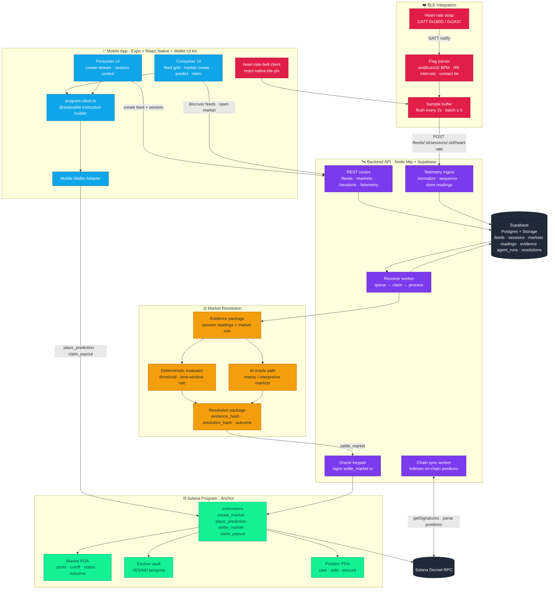

<div align="center">


# OddsOn

**Live-feed prediction markets on Solana, settled by what your body actually does.**

Prosumers stream. A BLE heart-rate belt produces verifiable evidence. Consumers spin up YES/NO markets around the live session. An oracle resolves on-chain. Payouts are trustless.

[](https://solana.com)
[](https://expo.dev)
[](https://www.bluetooth.com/specifications/specs/heart-rate-service-1-0/)
[](https://www.anchor-lang.com/)

</div>

---

## ✨ What it is

OddsOn is a Solana-mobile-first prediction market dApp. Two roles, one feed:

- **Prosumers** publish a livestream and pair a BLE heart-rate belt. Their session becomes the source of truth.
- **Consumers** discover live feeds, create or join YES/NO markets ("BPM crosses 165 in the next 60s?"), and claim payouts when the market resolves.

Settlement is hybrid: **deterministic** for structured biometric thresholds, and an **AI oracle path** for messier, interpretive markets. Both roads end the same way — a signed resolution package gets pushed on-chain by the oracle authority, and the program releases escrow.

---

## 🏗️ Technical Architecture



### The three load-bearing pieces

#### 🔴 Stream connection
A prosumer opens **`create-stream`**, picks an embed URL and a device label, and the app posts a `feed` + `live` `feed_session` to the backend. The session id is the join key everything else hangs off — markets reference it, telemetry posts to it, and the resolver pulls evidence through it. Consumers reach the same session through `/feed/[id]` and see the embed plus every market attached to it.

> Code: `app/create-stream.tsx`, `features/markets/markets.api.ts`, `features/markets/use-feeds.ts`

#### ⚖️ Market resolution
At cutoff, the backend's **resolver worker** atomically claims the next queued `agent_run`, loads the market and its evidence (or builds an audit-evidence record from the live session), evaluates the rule against ordered heart-rate readings, and produces a deterministic `resolution_package` with `evidence_hash`, `analysis_hash`, and `resolution_hash`. The package is signed by the **oracle authority keypair** and pushed to the Anchor program via `settle_market`. A separate **chain-sync worker** mirrors on-chain state back to Supabase so the UI sees a consistent view.

> Code: `backend/src/server.mjs` — `processAgentRun`, `buildResolutionPackage`, `settleMarketOnChain`, `runResolverWorker`, `runChainSyncWorker`

#### ❤️ BLE integration
The Android client speaks the standard BLE Heart Rate GATT profile: scans for service `0x180D`, subscribes to characteristic `0x2A37`, and parses each notification respecting the flags byte (uint8 vs uint16 BPM, energy-expended, RR-intervals, contact bit). Readings are sequence-numbered, buffered, and flushed every **2s** in batches of **≥5** to `POST /feeds/:id/sessions/:sid/heart-rate`. Permissions, scanning, retries, and stale-disconnect handling are managed by a singleton client so the strap survives navigation.

> Code: `features/prosumer/heart-rate-belt-client.ts`, `features/prosumer/use-prosumer-heart-rate.ts`, `features/prosumer/heart-rate-session.ts`

---

## 🧱 Stack

| Layer | Tech |
|---|---|
| Mobile | Expo 55 · React Native 0.83 · React 19 · expo-router · Reanimated |
| Wallet | `@wallet-ui/react-native-kit` · Solana Mobile Wallet Adapter |
| Solana | `@solana/kit` · Anchor program · devnet |
| BLE | `react-native-ble-plx` · standard HRP profile |
| Backend | Node `http` (zero-framework) · Supabase REST · oracle keypair signer |
| Storage | Supabase Postgres + Storage bucket |

---

## 🚀 Run it

```bash
# 1. Install
npm install

# 2. Backend (Supabase + oracle env in backend/.env.local)
npm run api:dev:live

# 3. Mobile (Android device with the BLE strap paired)
npm run android
```

The app expects a devnet wallet, the backend on `localhost:8787`, and the Anchor program id wired into `constants/app-config.ts`.

---

## 📁 Layout

```
app/                Expo Router screens (feed, market, create-*, result, challenge)
features/
  markets/          Feeds, sessions, markets — types, API client, hooks
  prosumer/         BLE strap client + telemetry flush hook
  program/          @solana/kit instruction builder for the Anchor program
  account/          Wallet connect, balance, sign
backend/src/        Single-file Node API: routes, resolver worker, chain sync
supabase/           Migrations + seed for the off-chain schema
docs/               Project scope, program spec, settlement plan
```

---

<div align="center">

Built for Consensus '26 · Solana Mobile Hackathon

</div>
